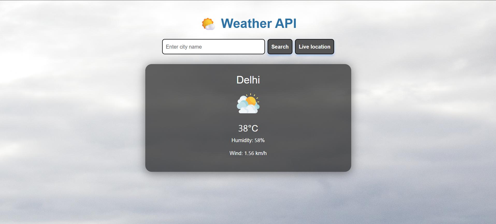

Link: https://weather-api-js-lime.vercel.app/
# Weather API App

A simple weather application built with HTML, CSS (Bootstrap), and JavaScript. It allows users to search for the current weather in any city or use their live location to get weather updates.

## Features
- Search weather by city name
- Get weather for your current location
- Displays temperature, humidity, wind speed, and weather icon
- Responsive design using Bootstrap

## How to Use
1. Open `index.html` in your browser.
2. Enter a city name and click **Search** to get the weather.
3. Or click **Live location** to get weather for your current location.

## Project Structure
```
index.html         # Main HTML file
style.css          # Custom styles
script.js          # JavaScript logic for fetching and displaying weather
images/            # Weather icons and background images
```

## Dependencies
- [Bootstrap 5](https://getbootstrap.com/)
- [OpenWeatherMap API](https://openweathermap.org/api) (You need to add your API key in `script.js`)

## Screenshots


---

Feel free to customize and enhance this project!